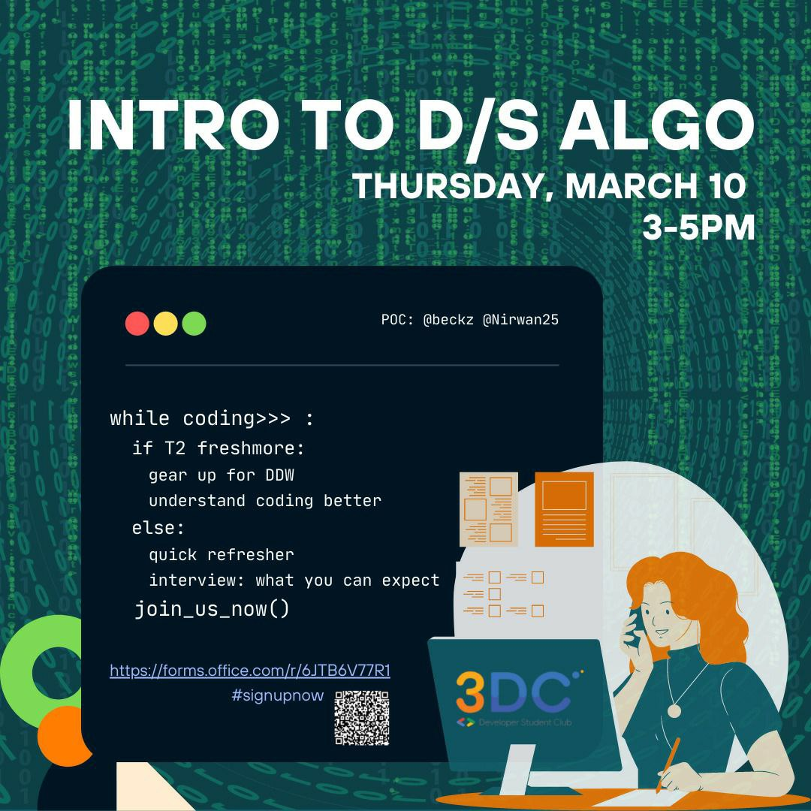

# Intro to Data Structures & Algorithms Workshop

The workshop is a one off workshop that aims to be a primer for Data Structures/Algorithms courses, as well as a 'what-to-expect' guide for technical interviews/

# Pre-requisites
- Basic Python Knowledge
- Lists
- Object-oriented Programming in Python

# Files
'src code' contains all Python code related to the course material
